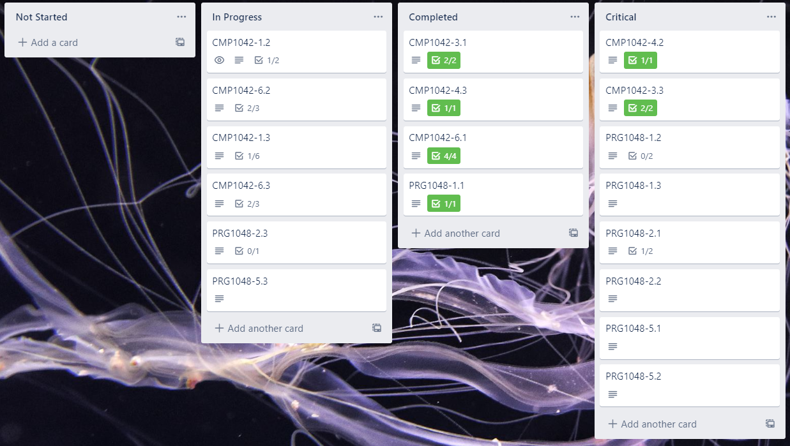
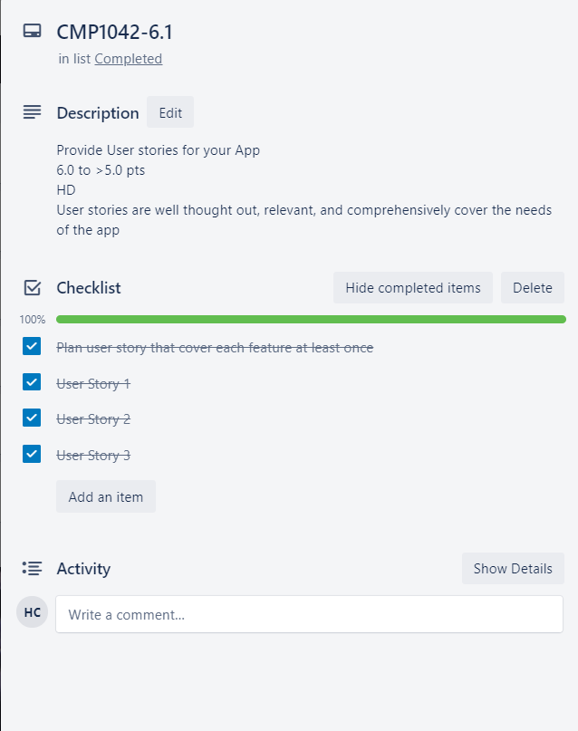
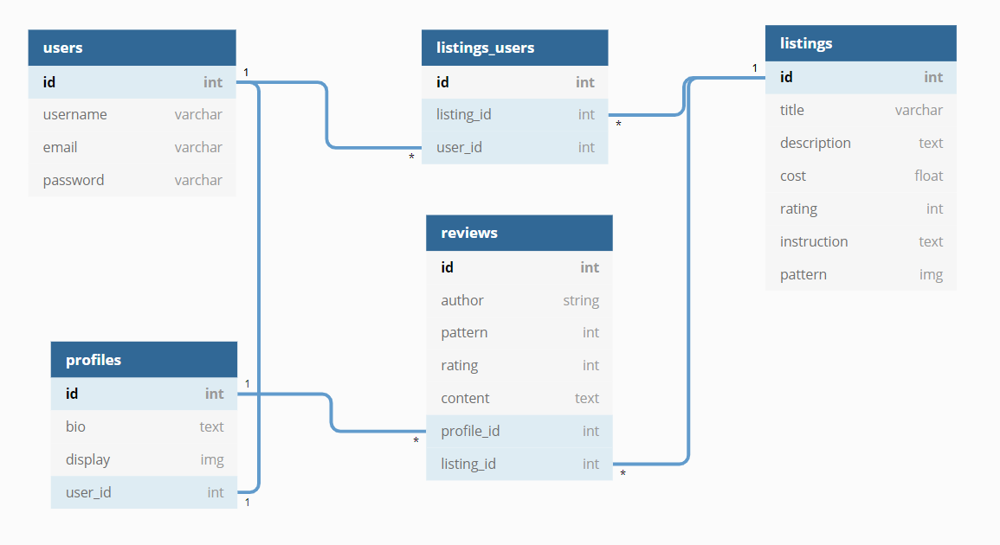
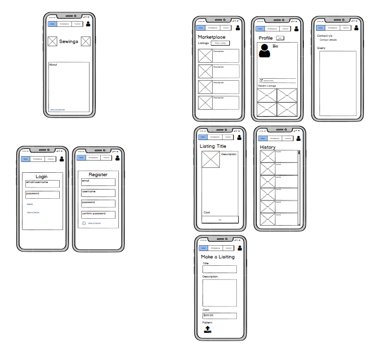
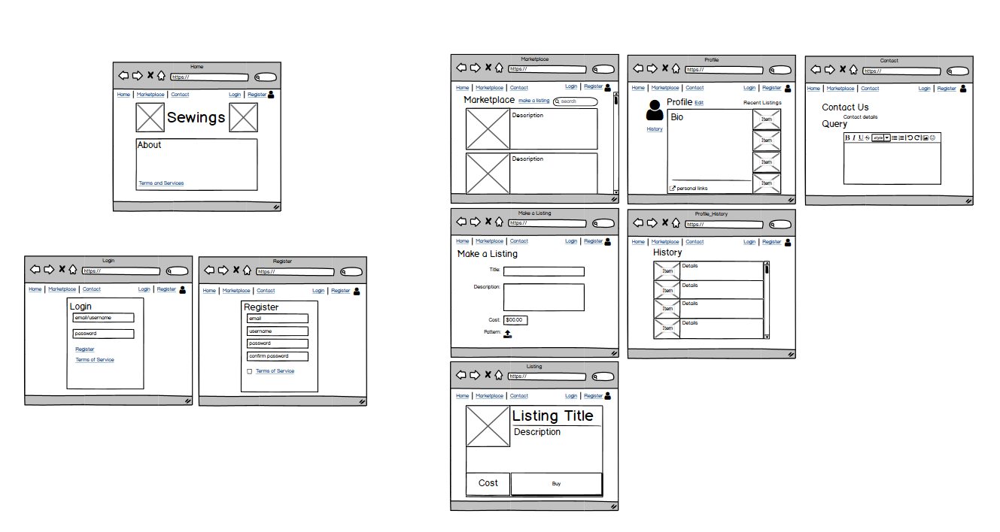

# Sewings

#### Trello:
https://trello.com/b/0GLcO0Sq/market-place-assignment

Git Repo
https://github.com/Hugh-Charlton/Marketplace-assignment

The original concept for Sewings was a store front for users to buy and sell patterns.  I wanted this site focus on smaller scale trading were products sold were produced by an individuals hobby or potentially a small business.  I wanted to try and push out any large scale compedative manufacturers.

Outside of functioning as a marketplace that specialises in sewing patterns I wanted my site to contain the following features:

- Profiles containing a bio were indivudal users could advertise themselves to the site (grant access to related links, such as facebook groups or instagram). This comes with a list of recently placed listings, as a show case.  Users would also be able to see their private purchase history from here.

- A review system allowing users to rate patterns that they purchase.  This would be in a written for as well as a numerical rating that would be displayed on a pattern to help guide other users on the site to better quality patterns.

- A search function for the listings, the review system would tie into this allowing users to proiritise highly rated patterns.  Building in the ability to add tags to a listing could make it much easier for users to find patterns they're looking for.

- In an attempt to deter large scale trading users would be limited to only having a few patterns (likely 10) active on the site at one time.  This could be potentially raised as a subscription based service, however it would still need to be capped to prevent single entities from flooding the listings.

## Target Audience

This is the reason why I want to implement measueres to push away larger companies.  My target audience is anyone who enjoys to sew or wants to sew as a hobby and either wants to make some money out of it or support small business (eg. sewing teachers or local businesses).  Larger companies can cause tough competition for these traders and tend to offer patterns that are easily commerically available.  Hopefully by aiming to keep a large group of the traders on my site as hobbyists there will be a more diverse (interesting and personal) range of patterns for people to buy and learn from.

I big part of the theme or feeling I want my site to have is like a grandma's handiwork, a comfortable feel.

## Development

To organise task a useful tool is trllo (https://trello.com/b/0GLcO0Sq/market-place-assignment).  This would ehelp break down the development of the app in smaller sections and organise how to attack and complete each requirement.

The board is separated into four main lists, Not Starded, In Progress, Completed and Critical.  The lists are filled with a card for each rubric criteria.  This is to help visual the current progress of the app as whole and to see what needs the most attention at any one point in time.  These cards contain more details on each rubric and describe the criteria for attaining the highest marks for the respective learning outcome.  Most card contain a list of a break of the individual tasks (that have been planned for the app) that need to be completed to shift the Trello card along the queue.

An important part of planning out the features for the site and how they should be implemented is looking at the users, and how they will need to interact with the site.

| User Stories                                                                                                                              | Acceptance Criteria                                                                                                                                                                                                                                                        |
|-------------------------------------------------------------------------------------------------------------------------------------------|----------------------------------------------------------------------------------------------------------------------------------------------------------------------------------------------------------------------------------------------------------------------------|
| <strong>User Story 1:</strong> As a retiree I am looking to take sewing up as a hobby and  would like to interact with people with a similar interest. | The User will need to be able to:  <ul><li>Login and create a unique profile -Customise a profile, with text and images</li><li>Share information with other via links</li><li>interact with users via and content on the site</li></ul>                                                                  |
| <strong>User Story 2:</strong> I am a young adult looking to progress my sewing beyond  a hobby.                                                       | The User will need to be able to:  <ul><li>Login and make listing to the marketplace and/or make purchases</li><li>Advertise trades on a profile -Link to related resources for their trades and sewing</li><li>Interact with a review system (for receiving and giving feedback as well as QA)</li></ul> |
| <strong>User Story 3:</strong> As a child I want to learn to sew so that I can make my  mother a mother's day present.                                 | The User will need to be able to:  <ul><li>Access to patterns (Login and purchase)</li><li>Use a search function on the listings page to find suitable patterns for their needs</li></ul>                                                                                                     |

### ERD

Below is my site's inital ERD and the one I settled on.  My first draft had some huge issues with relations matching different data types and undefined relations. the big changes that I made to the 2nd version was removing the profile information from the users table to avoid repetition.  I defined all of the relationships (one to one etc.) and changed the relation between users and listings to a many to many through via the listings_users table as I wanted a specific user to have the ability to post many listings and for a listing to be purchased by many users.  As for the products table I thought I needed it to help with the creation of a search bar feature but I decided that it was unecessary.  The rest of the changes were mainly cutting down on extra collumns in my tables.

The main features and goals with my ERD design, was to keep the database simple and well connected.  The Users of my site are the starting point of my design, the table containing all the information they need to set up their account.  This is to give them the ability to login (needing a username, email and password) as well as be uniquely identifiable to other users.  From there the profile page is the home for each user and need to directly share information, each user will only have one profile page so these tables share a one to one relationship.  The main feature of the site is that it is a two way marketplace so a listings table is needed, each user needs to be able both make multiple listings and purchase multiple patterns, this is why the users and listings table share a many to many relationship through a listings_users table.  Finally to help the community determine the quality of the listings made on the site a reviews table is need to allow users to leave feedback on patterns in both a fleshed out response and on a scale.  The reviews would only be able to come fom users that are logged in and have purchased the pattern so they there needs to be a relationship between a review and the profile it is posted from, the reviews are tied to their respective listing and so a relationship is needed there too.  A single profile can post many reviews and therefore dhas a one to many relation, and a listing can have many reviews posted to it, resulting in another one to many relationship.

#### Initial ERD

#### Implemented ERD

For the most part the schema matches the final ERD with a couple of name changes for collumns.  For the images in my relational database I used active storage to manage this data instead of the collumns that I dedicated in my ERD as rails does recognise image as a data tag and it is recommended to used active storage.  Some changes are need to my users table due to the implementation of devise for authentication.  THis is to help with a secure login process.

## Wireframes

#### Phone Wireframes

#### Desktop Wireframes

### Third party programs

With the features planned out there are helpful tools that can get them implemented. As preveniously mentioned a big part of the site is that accounts need to be created for users to login and track numerous types of information.

Users need security with these accounts and a good program that I know of to help out with authenticity is Devise.

With the use of profile images and images needed to display the finished product of a pattern to is important to have an image upload feature in the app.  Active storage is a great option for this as it allows direct uploads and the sychronization of a file action multiple cload services.

Bootstrap can be used help build the front end side of the side, making it more appealing to users.  This is great for developing a theme for the site and can reduce the ammount of bugs across different browsers.

Users will need to submit forms when creating listings in the marketplace, a helpful gem for this is simple form.  This helps with making forms.

Byebug is an rails inbuilt gem that can help with testing code.  It helps stop code from progressing past where you want to test and display messages that can help with debugging.

Stripe is a user friendly and secure payment gateway, great for dealing with the purchases of patterns on the site.  Strip has an in death API that makes it easier to set up in the app as well as the fact that Stripe does not redirect users away from the site when they make a purchase.